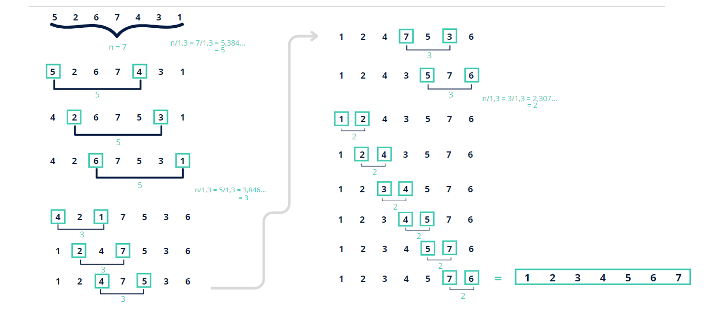

# COMBSORT


<div>

<br>


### Sobre o algoritmo


CombSort é um algoritmo de ordenação que foi desenvolvido como uma melhoria em relação ao BubbleSort. O objetivo principal do CombSort é reduzir o número de comparações e trocas necessárias para ordenar uma lista de elementos, especialmente aqueles que estão distantes uns dos outros na lista.

## Como Funciona

O conceito básico por trás do CombSort é eliminar "tartarugas", ou seja, valores pequenos que estão localizados no final da lista e precisam ser movidos para o início. Para fazer isso, o CombSort introduz a ideia de um "gap" (intervalo) entre os elementos que estão sendo comparados.

Gap Inicial: O algoritmo começa com um "gap" grande, geralmente o tamanho da lista dividido por um fator de redução (geralmente 1.3).

Comparações e Trocas: Elementos que estão distantes pelo valor do "gap" são comparados e, se necessário, trocados.

Redução do Gap: Após cada iteração, o "gap" é reduzido, até que ele chegue a 1, onde o algoritmo então se comporta como um BubbleSort, comparando e trocando elementos adjacentes.

Critério de Parada: O algoritmo continua até que nenhuma troca seja necessária, indicando que a lista está ordenada.



## Implementação

Aqui está um exemplo de como o *CombSort* pode ser implementado em C:

```c

void combSort(Aluno **alunos, int qnt) {
    int gap = qnt;
    float fator = 1.3;
    int troca;

    while (gap > 1 || troca) { //C1 * log n
        gap = (int)(gap / fator);
        if (gap < 1) gap = 1;

        troca = 0;

        for (int i = 0; i + gap < qnt; i++) { // C2 * n * log n
            if (alunos[i]->matricula > alunos[i + gap]->matricula) {
                Aluno *temp = alunos[i];
                alunos[i] = alunos[i + gap];
                alunos[i + gap] = temp;
                troca = 1;
            }
        }
    }
}

```


## Como rodar na minha maquina?

Primeiro Clone o repositorio na sua maquina:

```bash
git clone https://github.com/lauragoncalvesf/COMBSORT.git
```

Para executar você precisa navegar até o diretório onde o arquivo c se encontra, e no terminal use este comando:

```
gcc main.c -o main && ./main
```

  <h2 id="complexity" style="font-weight: bold; font-size: 2rem">Complexidade</h2>

### Pior Caso:
 O(n²)


### Melhor Caso:
O(n log n)


<h2 id="colab" style="font-weight: bold; font-size: 2rem">Contribuidores</h2>
 
<table>
</div>
<table> <tr> <td align="center"> <a href="#"> <br> <sub> <a href="https://github.com/anavitoriaq"><b>Ana Vitória</b></a> </sub> </a> </td> <td align="center"> <a href="#"> <br> <sub> <a href="https://github.com/lauragoncalvesf"><b>Laura Gonçalves</b></a> </sub> </a> </td> </tr> </table>
</div>